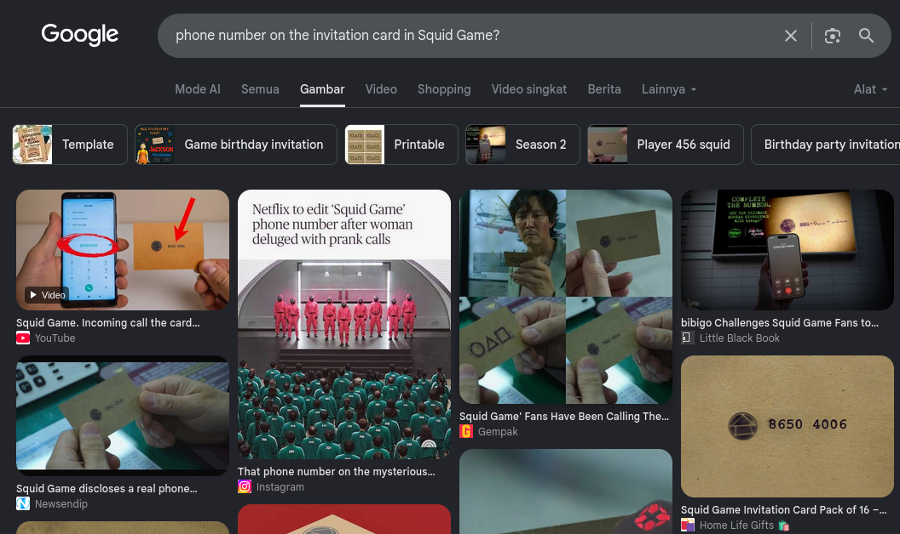
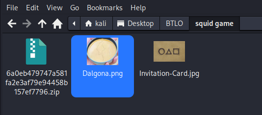
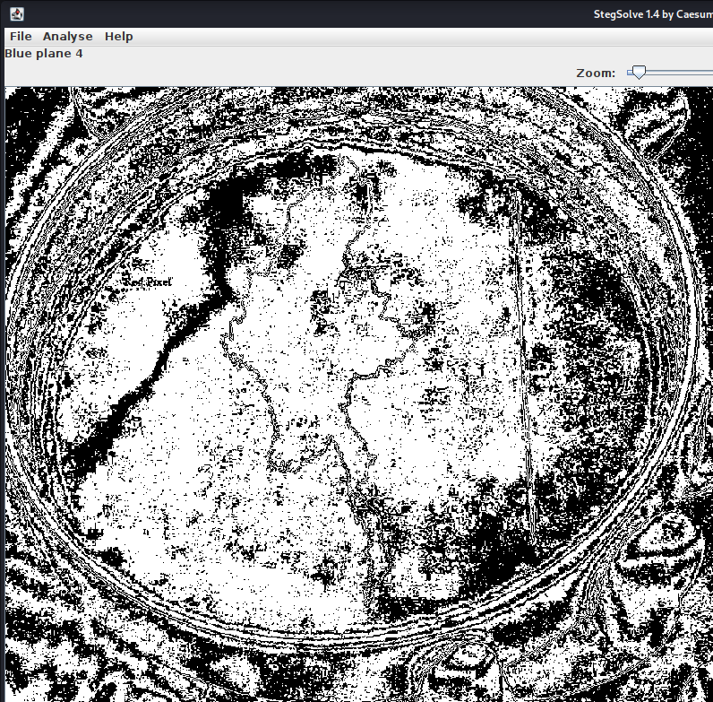
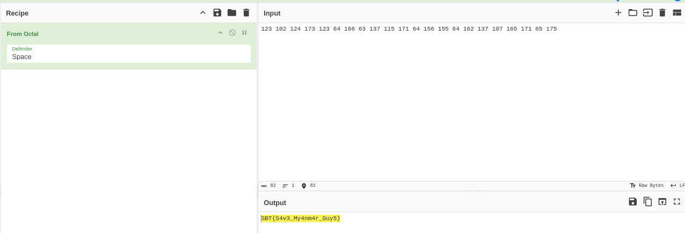

# 🕵️‍♂️ BTLO: SQUID GAME - CTF Challenge

**Platform**: Blue Team Labs Online (BTLO)  
**Category**: CTF / Steganography  
**Status**: ✅ Completed

---

## 📖 Scenario

> *"Will you survive the Squid Games?"*

**Objective**: Solve a series of steganography and puzzle challenges inspired by the Squid Game theme to uncover the final flag.

---

## 🛠️ Tools Used

- **Steghide** – Extracting hidden files from images
- **Stegsolve.jar** – Analyzing image color channels
- **PixSpy** – RGB value analysis ([https://pixspy.com/](https://pixspy.com/))

---

## 📊 Investigation Findings

| # | Question | Answer |
|---|----------|--------|
| 1 | Phone number on the invitation card | `86504006` |
| 2 | Extracted file name | `Dalgona.png` |
| 3 | Hidden text discovered | `Red Pixel` |
| 4 | Final flag | `SBT{S4v3_My4nm4r_Guy5}` |

---

## 🔍 Key Investigation Steps

### 1. Phone Number Discovery
- Performed a Google search for "Squid Game invitation card phone number."
- Found the phone number: `86504006`.

### 2. Extracting Hidden Content
- Extracted the provided ZIP file to find `Invitation-Card.jpg`.
- Noticed the file size was unusually large—a clear indicator of hidden content.
- Used **steghide** with the phone number as the passphrase to extract the hidden file.
- Extracted file: `Dalgona.png`.

### 3. Revealing Hidden Text
- The `Dalgona.png` image contained hidden text not visible normally.
- Used **stegsolve.jar** to manipulate image colors and reveal the hidden text.
- Discovered the text: `Red Pixel`.

### 4. Final Flag Extraction
- Examined the Dalgona image carefully and noticed a vertical line next to the island.
- Used **PixSpy** ([https://pixspy.com/](https://pixspy.com/)) for RGB analysis:
  1. Uploaded the image to the website.
  2. Set the format to `$r, $g, $b`.
  3. Clicked on the vertical line from top to bottom.
  4. Extracted the `$r` values and decoded the message.
- Revealed the final flag: `SBT{S4v3_My4nm4r_Guy5}`.

---

## 📸 Screenshots

Below are the key evidence screenshots captured during the investigation.

---

### Question 1: Phone Number

---

### Question 2: Extracted File Name

---

### Question 3: Hidden Text

---

### Question 4: Final Flag

---

## 📝 Key Takeaways

- **Steganography hides secrets in plain sight** – Images can contain hidden files and messages.
- **File size anomalies are clues** – An unusually large image file often indicates hidden content.
- **Color manipulation reveals hidden text** – Tools like stegsolve can expose messages embedded in image channels.
- **RGB analysis is powerful** – Extracting specific color values can reveal encoded data.
- **CTF challenges make learning fun** – Pop culture themes like Squid Game make cybersecurity training engaging.

---

## 🔗 External Links

- 📖 **Full Walkthrough (Medium)**: [Read Here](https://medium.com/@raenaldsyaputra57/squid-game-btlo-walkthrough-2f6a7ce9dd5f)
- 📂 **Back to Main Repository**: [Cybersecurity-Writeups](../../README.md)

---

*Written with 🖥️ by Renaldy Syaputra*
