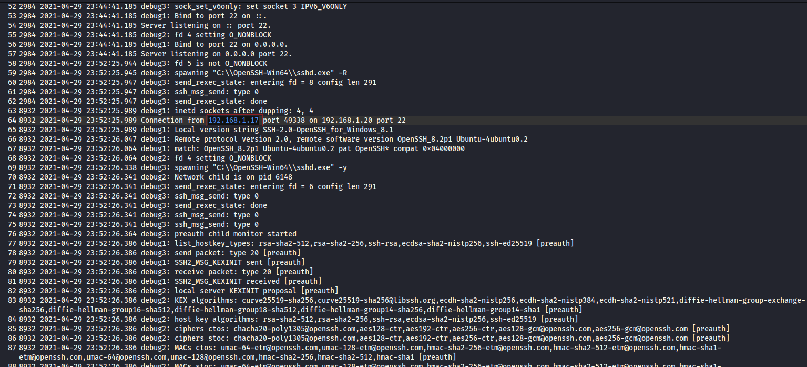
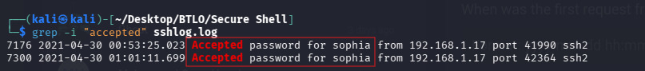
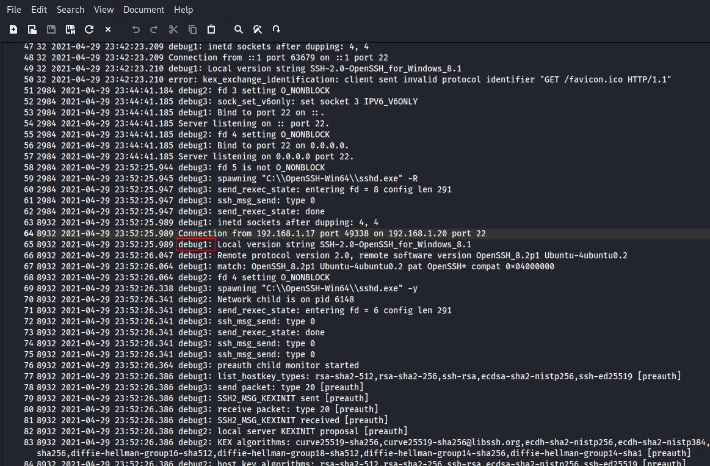
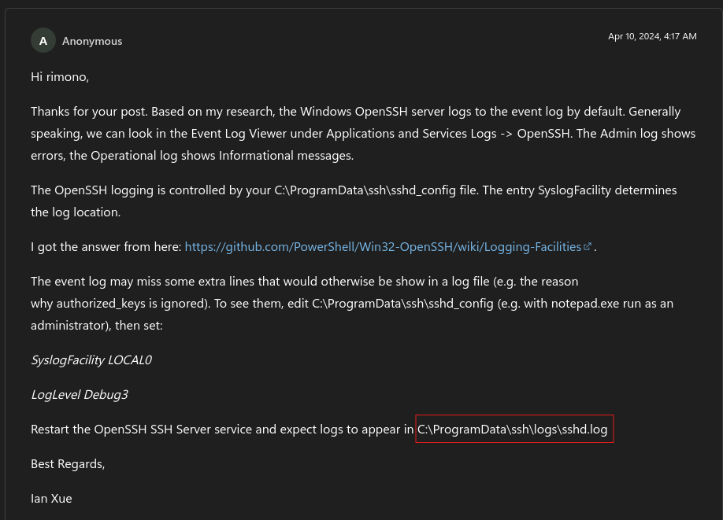

# 🕵️‍♂️ BTLO: Secure Shell - Log Analysis

**Platform**: Blue Team Labs Online (BTLO)  
**Category**: Log Analysis / SOC  / DFIR
**Status**: ✅ Completed

---

## 📖 Scenario

> *"Hey! We had a SSH service on a system and noticed unusual change in size of the log file. Don't panic, it was the new IT guys' daughter who said she was able to break into the system. I had given her permission to test some of these services. I am giving you the log file, can you solve the following queries?"*

**Objective**: Analyze the provided SSH log file to identify unauthorized access attempts, valid accounts, and key forensic artifacts.

---

## 🛠️ Tools Used

- **grep** – Pattern matching and log filtering
- **awk** – Text processing and data extraction
- **Kali Linux** – Primary analysis environment

---

## 📊 Investigation Findings

| # | Question | Answer |
|---|----------|--------|
| 1 | Attack type and attacker IP | `external:192.168.1.17` |
| 2 | Valid accounts found | `1:sophia` |
| 3 | Login attempts | `2` |
| 4 | First request timestamp | `2021-04-29 23:52:25.989` |
| 5 | Log level | `Debug1` |
| 6 | Log file location in Windows | `C:\ProgramData\ssh\logs\sshd.log` |

---

## 🔍 Key Investigation Steps

### 1. Identifying the Attacker
- Inspected the log file to find suspicious IP addresses.
- Found `192.168.1.17` attempting to access `192.168.1.20`.
- Determined it was an **external** attack based on IP address ranges.

### 2. Finding Valid Accounts
- Used the command: `grep -i "accepted" sshlog.log` to filter successful authentication attempts.
- Identified one valid user: **sophia**.
- Counted **2** login attempts to this account.

### 3. Establishing Timeline
- Located the first connection attempt from `192.168.1.17`.
- Timestamp recorded: **2021-04-29 23:52:25.989**.

### 4. Log Level Identification
- Found `Debug1` as the log level in the entry immediately following the first request.

### 5. Windows Log File Location
- Researched the default SSH log file location in Windows systems.
- Standard path: `C:\ProgramData\ssh\logs\sshd.log`.

---

## 📸 Screenshots

Below are the key evidence screenshots captured during the investigation, mapped to each question.

---

### Question 1: Attacker IP & Attack Type
*Log entry showing the attacker IP `192.168.1.17` attempting connection.*

| Evidence | Detail |
|----------|--------|
|  | *External attack from `192.168.1.17`* |

---

### Question 2: Valid Accounts Found
*`grep` filter output showing the accepted authentication for user `sophia`.*

| Evidence | Detail |
|----------|--------|
|  | *Filtered log showing `Accepted` entry for sophia* |

---

### Question 3: Login Attempts
*The same filtered output also reveals the total number of login attempts to `sophia`.*

| Evidence | Detail |
|----------|--------|
|  | *2 login attempts detected* |

---

### Question 4: First Request Timestamp
*First connection from attacker recorded in the log.*

| Evidence | Detail |
|----------|--------|
|  | *Timestamp: 2021-04-29 23:52:25.989* |

---

### Question 5: Log Level
*Log level `Debug1` identified in the entry after the first request.*

| Evidence | Detail |
|----------|--------|
|  | *Log level: Debug1* |

---

### Question 6: Windows Log Location
*Reference showing the default Windows SSH log file location.*

| Evidence | Detail |
|----------|--------|
|  | *Location: C:\ProgramData\ssh\logs\sshd.log* |

---

## 📝 Key Takeaways

- **Basic CLI tools are powerful** – `grep` and `awk` can handle most log analysis tasks without heavy SIEM tools.
- **Understand SSH log patterns** – Keywords like `"accepted"` indicate successful authentication, while `"failed"` indicates brute-force attempts.
- **Log levels provide context** – `Debug1` offers detailed information useful for troubleshooting and investigations.
- **Know default file paths** – Familiarity with standard OS log locations speeds up forensic investigations.
- **IP ranges matter** – Understanding public vs. private IP ranges helps determine if an attack is internal or external.

---

## 🔗 External Links

- 📖 **Full Walkthrough (Medium)**: [Read Here](https://medium.com/@raenaldsyaputra57/secure-shell-btlo-walkthrough-71c7ee36f94b)
- 🏆 **BTLO Achievement**: [Look Here](https://blueteamlabs.online/achievement/share/challenge/161475/17)
- 📂 **Back to Main Repository**: [Cybersecurity-Writeups](../../README.md)
