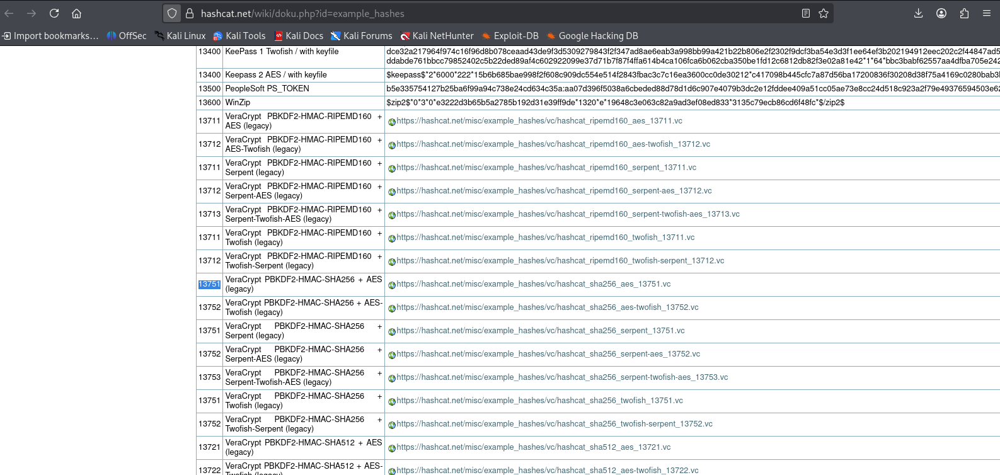
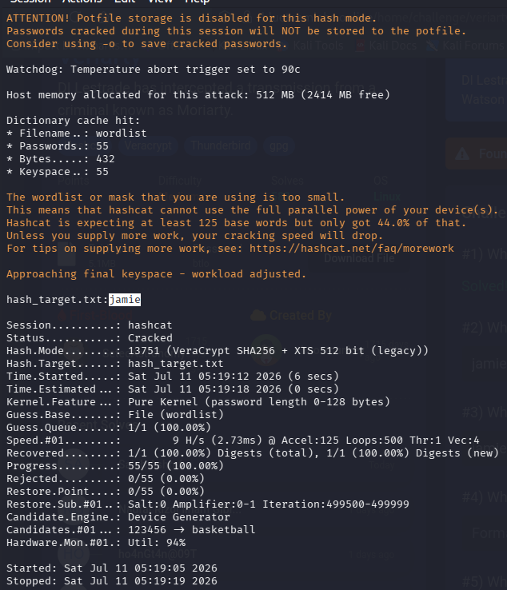
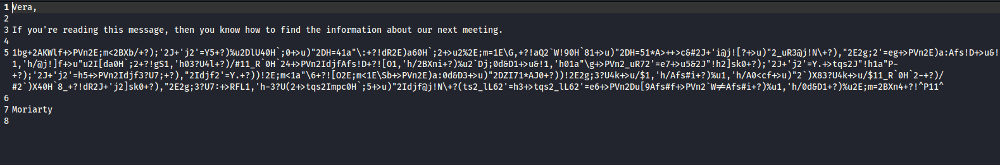
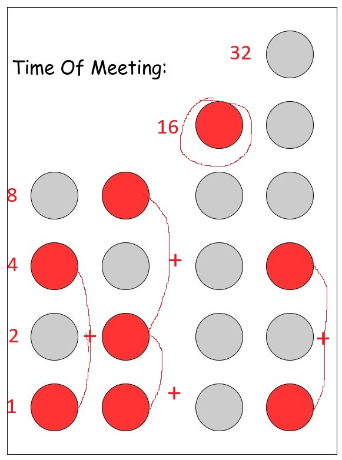

# 🕵️‍♂️ BTLO: VERIARTY - Cryptography & Forensics

**Platform**: Blue Team Labs Online (BTLO)  
**Category**: Cryptography / Digital Forensics  
**Status**: ✅ Completed

---

## 📖 Scenario

> *"DI Lestrade has intercepted a transmission from a criminal known as Moriarty. He's asked his good buddy Sherlock Holmes and John Watson (that's you) to use their skills as investigators to work out what he's up to."*

**Objective**: Investigate encrypted files, crack passwords, and uncover the criminal's plans by decrypting containers, emails, and hidden messages.

---

## 🛠️ Tools Used

- **Hashcat** – Password cracking with dictionary attack
- **VeraCrypt** – Container extraction and encryption
- **GPG** – Email decryption
- **Thunderbird** – Email client for reading decrypted emails
- **dd** – Extracting first 512 bytes from container file

---

## 📊 Investigation Findings

| # | Question | Answer |
|---|----------|--------|
| 1 | Hashcat hash type (`-m` flag) | `13751` |
| 2 | Password to unlock the container | `jamie` |
| 3 | Name of Moriarty's general sending the email | `vera` |
| 4 | Meeting location | `central perk, piccadilly circus` |
| 5 | Meeting date and time | `5th November, 16:05` |

---

## 🔍 Key Investigation Steps

### 1. Hash Identification
- Read the `README first.txt` file carefully for context.
- Visited Hashcat Wiki → Example Hashes to identify the correct hash type.
- Identified the hash type as `13751`.

### 2. Password Cracking
- Extracted the first 512 bytes from `container.vc` using the `dd` command.
- Ran Hashcat with the extracted file and a wordlist (dictionary attack).
- Successfully cracked the password: `jamie`.

### 3. Container Extraction
- Used VeraCrypt to mount/extract `container.vc` using the cracked password.
- Discovered two files: an email file (GPG-encrypted) and `secret.key`.

### 4. Email Decryption
- Decrypted the GPG-encrypted email file using GPG.
- Read the email in Thunderbird to reveal the sender's identity.
- Identified the sender as **vera**.

### 5. Secret Key Analysis
- Extracted `secret.key` using VeraCrypt with `secret.pub` as the key file.
- Found multiple files including images and text files.
- Decoded the `Decode Me.jpg` binary clock image to reveal the meeting time.
- Analyzed other images to locate the meeting place: **central perk, piccadilly circus**.

---

## 📸 Screenshots

Below are the key evidence screenshots captured during the investigation.

---

### Question 1: Hash Type

---

### Question 2: Password

---

### Question 3: Sender's Name

---

### Question 4: Meeting Location
*Evidence 1: Location confirmation.*  

*Evidence 2: Location details.*  

---

### Question 5: Meeting Date & Time

---

## 📝 Key Takeaways

- **Multi-layered encryption is common** – Criminals often use multiple tools (VeraCrypt, GPG) to protect their communications.
- **Hashcat is powerful** – Knowing the correct hash type (`-m` flag) is crucial for successful password cracking.
- **Dictionary attacks work** – Many passwords are weak and can be cracked using wordlists.
- **GPG encryption protects emails** – Decrypting GPG-encrypted files requires the correct keys.
- **Steganography hides information** – Binary clocks and hidden images can encode critical data.
- **Red herrings are everywhere** – Being methodical and careful is key to avoiding distractions.

---

## 🔗 External Links

- 📖 **Full Walkthrough (Medium)**: [Read Here](https://medium.com/@raenaldsyaputra57/veriarty-btlo-walkthrough-1d4c5e6fa6ee) 
- 📂 **Back to Main Repository**: [Cybersecurity-Writeups](../../README.md)
