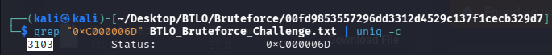
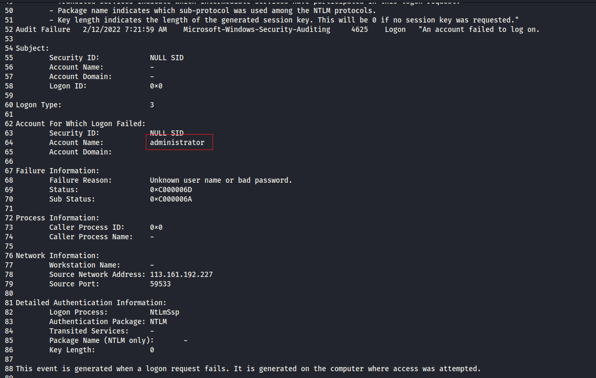
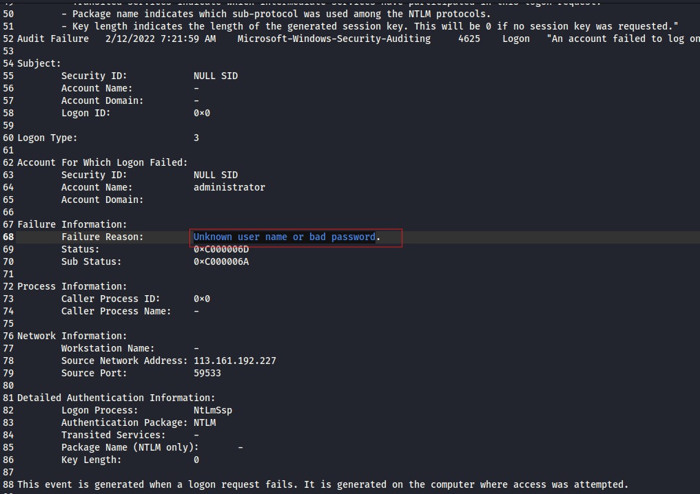
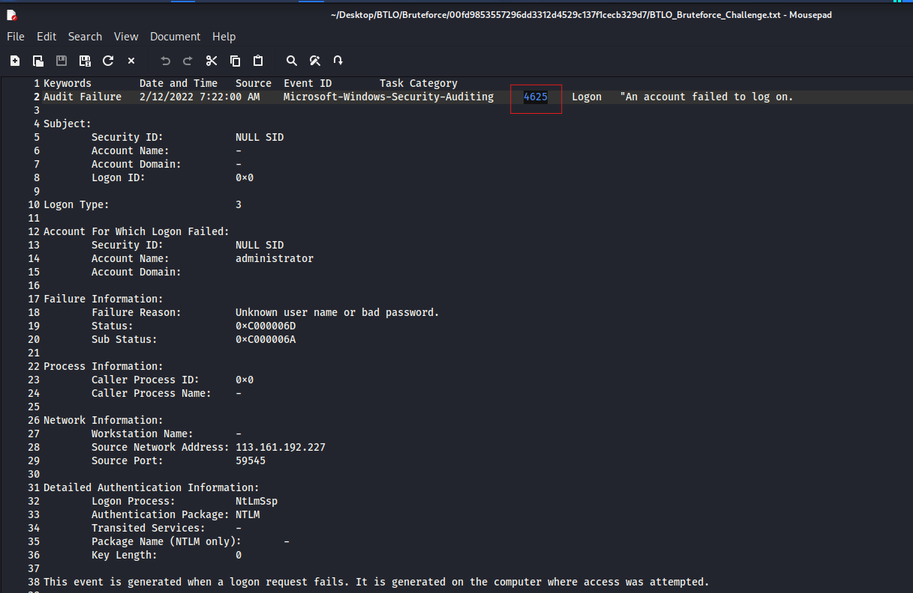
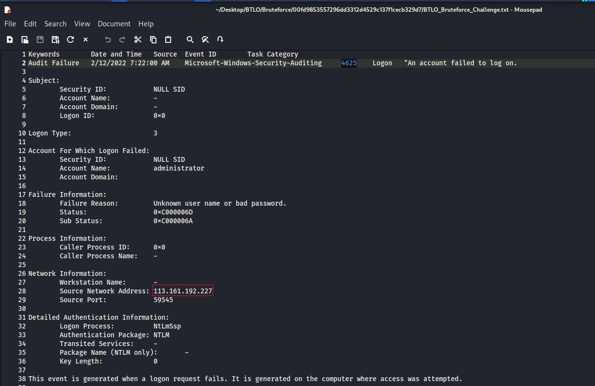
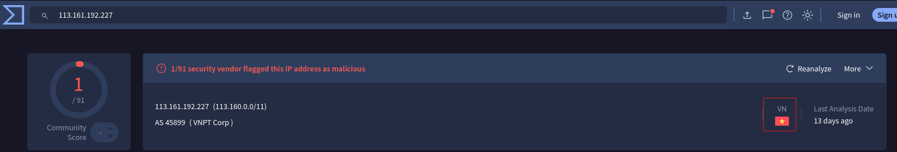
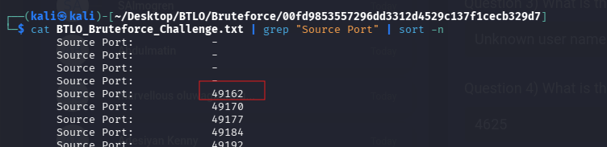
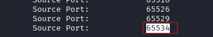

# 🕵️‍♂️ BTLO: BRUTEFORCE - Incident Response

**Platform**: Blue Team Labs Online (BTLO)  
**Category**: Incident Response / Log Analysis  
**Status**: ✅ Completed

---

## 📖 Scenario

> *"Can you analyze logs from an attempted RDP bruteforce attack?*
>
> *One of our system administrators identified a large number of Audit Failure events in the Windows Security Event log."*

**Objective**: Analyze Windows RDP log files to investigate a brute-force attack and identify key indicators.

---

## 🛠️ Tools Used

- **grep** – Pattern filtering and log analysis
- **uniq -c** – Counting unique occurrences
- **sort -n** – Sorting numerical values
- **VirusTotal** – IP geolocation lookup
- **Kali Linux** – Primary analysis environment

---

## 📊 Investigation Findings

| # | Question | Answer |
|---|----------|--------|
| 1 | How many Audit Failure events are there? | `3103` |
| 2 | What is the username of the local account that is being targeted? | `administrator` |
| 3 | What is the failure reason related to the Audit Failure logs? | `Unknown user name or bad password` |
| 4 | What is the Windows Event ID associated with these logon failures? | `4625` |
| 5 | What is the source IP conducting this attack? | `113.161.192.227` |
| 6 | What country is this IP address associated with? | `Vietnam` |
| 7 | What is the range of source ports used by the attacker? | `49162-65534` |

---

## 🔍 Key Investigation Steps

### 1. Counting Audit Failure Events
- Filtered logs using the failure status code pattern `0xC000006D`.
- Used `grep` and `uniq -c` to count total failure events.

### 2. Identifying Targeted Account
- Examined which account name appeared most frequently in failure logs.
- Found `administrator` as the primary target.

### 3. Determining Failure Reason
- Checked the "Failure Reason" section in the failure logs.
- Identified `Unknown user name or bad password`.

### 4. Event ID Discovery
- Reviewed the log header sections.
- Found Windows Event ID `4625` associated with the logon failures.

### 5. Source IP Identification
- Located the "Source Network Address" field in the failure logs.
- Identified `113.161.192.227` as the attacker's IP.

### 6. Geolocation Enrichment
- Submitted the IP address to VirusTotal for geolocation.
- Confirmed the country of origin as **Vietnam**.

### 7. Source Port Range Analysis
- Filtered for source ports using `grep`.
- Sorted numerically using `sort -n` to determine the range.
- Found source ports ranging from `49162` to `65534`.

---

## 📸 Screenshots

Below are the key evidence screenshots captured during the investigation.

---

### Question 1: Audit Failure Events

---

### Question 2: Targeted Username

---

### Question 3: Failure Reason

---

### Question 4: Event ID

---

### Question 5: Source IP Address

---

### Question 6: Country of Origin

---

### Question 7: Source Port Range
*Evidence 1: Filtered source ports sorted numerically.*  

*Evidence 2: Port range confirmation.*  

---

## 📝 Key Takeaways

- **Audit Failure events are early indicators** – A high volume of failure events often signals a brute-force attack in progress.
- **Event ID 4625 is critical** – This ID corresponds to failed logon attempts and is essential for detecting brute-force activity.
- **Source IP and ports reveal attacker patterns** – Analyzing network addresses and port ranges helps identify attack infrastructure.
- **Geolocation provides threat context** – Knowing the country of origin can help assess the threat level.
- **Windows RDP attacks are common** – Securing RDP with strong passwords, MFA, or network-level authentication is essential.

---

## 🔗 External Links

- 📖 **Full Walkthrough (Medium)**: [Read Here](https://medium.com/@raenaldsyaputra57/bruteforce-btlo-walkthrough-1868e66f0c18) 
- 📂 **Back to Main Repository**: [Cybersecurity-Writeups](../../README.md)

---

*Written with 🖥️ by Renaldy Syaputra*
