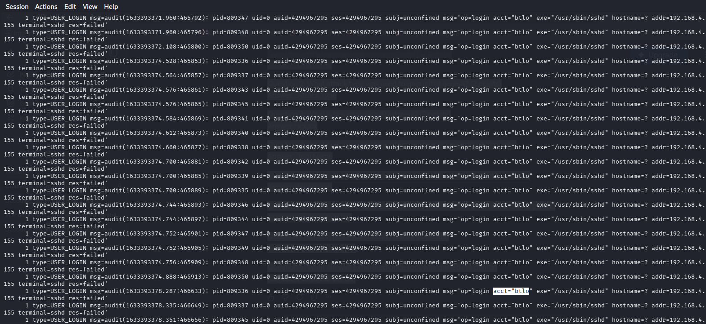
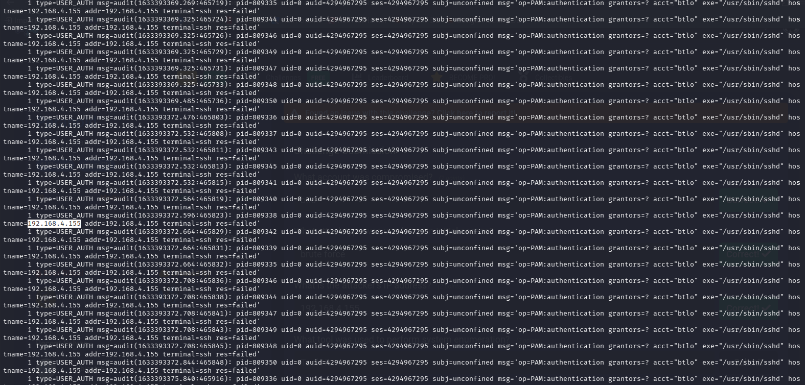
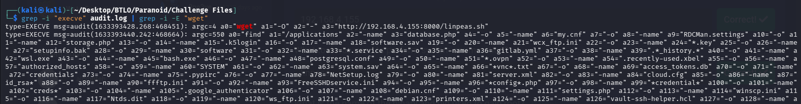
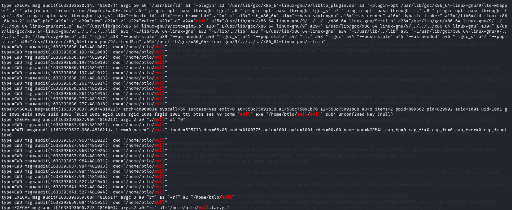
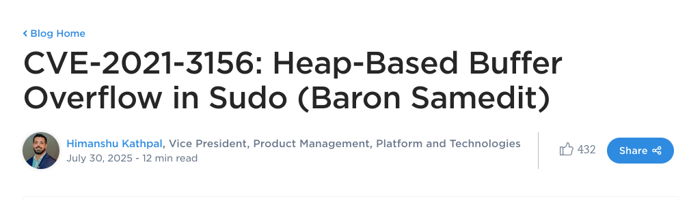
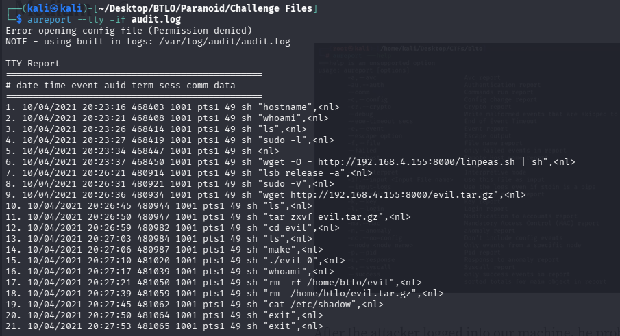

# 🕵️‍♂️ BTLO: PARANOID - Incident Response

**Platform**: Blue Team Labs Online (BTLO)  
**Category**: Incident Response / Log Analysis  
**Status**: ✅ Completed

---

## 📖 Scenario

*No scenario provided for this lab.*

**Objective**: Analyze the provided `audit.log` file to identify a compromised account, attack vectors, attacker infrastructure, privilege escalation, and exfiltrated data.

---

## 🛠️ Tools Used

- **grep** – Pattern filtering and log analysis
- **sort** – Sorting log entries
- **aureport** – Advanced log analysis for audit logs
- **Google Search** – Vulnerability research (CVE lookup)

---

## 📊 Investigation Findings

| # | Question | Answer |
|---|----------|--------|
| 1 | What account was compromised? | `btlo` |
| 2 | What attack type was used to gain initial access? | `brute force` |
| 3 | What is the attacker's IP address? | `192.168.4.155` |
| 4 | What tool was used to perform system enumeration? | `linpeas` |
| 5 | What is the name of the binary and PID used to gain root? | `evil, 829992` |
| 6 | What CVE was exploited to gain root access? | `CVE-2021-3156` |
| 7 | What type of vulnerability is this? | `Heap-Based Buffer Overflow` |
| 8 | What file was exfiltrated once root was gained? | `/etc/shadow` |

---

## 🔍 Key Investigation Steps

### 1. Identifying the Compromised Account
- Determined how the log file defines an account (`user` field).
- Used `grep` to filter for account-related entries.
- Identified the account `btlo` as the target of repeated failed login attempts.

### 2. Attack Type Identification
- Observed repeated login attempts to the `btlo` account.
- Recognized the pattern as a **brute force** attack.

### 3. Attacker IP Discovery
- Filtered log entries for the compromised account.
- Found the attacker's IP address in the `hostname` field: `192.168.4.155`.

### 4. System Enumeration Tool
- Filtered for `wget` activity to identify downloaded tools.
- Found the attacker downloading **linpeas**, a Linux privilege escalation enumeration tool.

### 5. Privilege Escalation Binary & PID
- Analyzed `aureport -p -if audit.log` with filtering for suspicious binaries.
- Identified the binary `evil` with PID `829992` used to gain root access.

### 6. CVE Identification
- Researched the exploitation method using Google.
- Found **CVE-2021-3156** (Baron Samedit) – a heap-based buffer overflow in `sudo`.

### 7. Vulnerability Type
- Researched CVE-2021-3156.
- Identified the vulnerability type as **Heap-Based Buffer Overflow**.

### 8. Exfiltrated File
- Reviewed keystroke logs from `aureport --tty`.
- Found the attacker exfiltrating the shadow file: `/etc/shadow`.

---

## 📸 Screenshots

Below are the key evidence screenshots captured during the investigation.

---

### Question 1: Compromised Account

---

### Question 3: Attacker IP Address

---

### Question 4: System Enumeration Tool

---

### Question 5: Binary & PID

---

### Question 6 & 7: CVE & Vulnerability Type

---

### Question 8: Exfiltrated File

---

## 📝 Key Takeaways

- **Audit logs are a goldmine for forensic investigations** – They contain detailed records of system activity.
- **Understanding log formats is crucial** – Different systems use different terminology for accounts, processes, and events.
- **Attackers often download tools via wget** – This leaves a clear digital footprint that can be traced.
- **aureport is a powerful tool** – It provides clean, structured output for analyzing audit logs.
- **Privilege escalation often involves known CVEs** – CVE-2021-3156 (Baron Samedit) is a well-known vulnerability in `sudo`.
- **Shadow file exfiltration is a common post-compromise goal** – Attackers target it to crack password hashes offline.

---

## 🔗 External Links

- 📖 **Full Walkthrough (Medium)**: -
- 📂 **Back to Main Repository**: [Cybersecurity-Writeups](../../README.md)

