# 🕵️‍♂️ Hacktrace-Ranges: DEIMOS - Network Forensics

**Platform**: Hacktrace-Ranges  
**Category**: Network Forensics  
**Status**: ✅ Completed

---

## 📖 Scenario

> *"The SOC team has sent a network packet capture capturing suspicious activity on one of the hosts in your organization. You are requested to investigate and analyze the network packet capture so that it can be followed up by the forensic team."*

**Objective**: Investigate the provided PCAP file to identify the victim host, malicious infrastructure, malware indicators, and persistence mechanisms.

---

## 🛠️ Tools Used

- **Wireshark** – Network traffic analysis and PCAP inspection
- **VirusTotal** – Malware hash enrichment and detection mapping
- **Any.run** – Dynamic malware behavior analysis
- **Google Search** – Hash lookup for threat intelligence reports

---

## 📊 Investigation Findings

| # | Question | Answer |
|---|----------|--------|
| 1 | Victim host IP address | `172.16.253.131` |
| 2 | Mail server domain | `mail.yaklasim.com` |
| 3 | Mail server IP address | `212.58.4.13` |
| 4 | URL accessed after mail server connection | `http://mail.yaklasim.com/ponyb/gate.php` |
| 5 | TCP flags during URL connection | `0x018 (SYN/ACK)` |
| 6 | Domain lookup after URL access | `clients.duncanwisniewski.com` |
| 7 | IP address of that domain | `64.90.61.19` |
| 8 | File requested by the victim host | `vHn3xjt.exe` |
| 9 | Location where PE file is dropped | `%APPDATA%` |
| 10 | Location of the called file | `%LOCALAPPDATA%\Temp` |
| 11 | Ssdeep hash of the file | `6144:uvWnMqSR7HGAJjwfx6y95mu7OYjHz5++iUHeiedUeDK9/26Zrz:39SBGwjEN80OyV+xU0FDK9/9` |
| 12 | Microsoft Windows Defender detection name | `PWS:Win32/Zbot!GO` |
| 13 | Registry hive location for persistence | `HKEY_CURRENT_USER\Software\Microsoft\Windows\CurrentVersion\Run` |

---

## 🔍 Key Investigation Steps

### 1. Identifying the Victim and Mail Server
- Applied the `dns` filter in Wireshark to locate DNS queries and responses.
- Found IP `172.16.253.131` associated with the mail server domain `mail.yaklasim.com`.
- Corroborated this by checking **Statistics → Endpoints** to see the high volume of packets originating from this host.

### 2. Tracing the Malicious URL Chain
- Observed the TCP handshake (SYN, ACK, PSH) indicating a successful connection to the mail server.
- Immediately after, the victim accessed the URL: `http://mail.yaklasim.com/ponyb/gate.php`.
- Checked the TCP flags section in Wireshark to confirm the flag value `0x018`.
- Shortly after, the victim performed a domain lookup for `clients.duncanwisniewski.com` with IP `64.90.61.19`.

### 3. Malware Download and File Analysis
- Identified the file request `vHn3xjt.exe` from the C2 domain.
- Extracted the file from the PCAP and calculated its SHA-256 hash:  
  `ffee1dd5823819f07e78a39b77ec50a6e2ace983352134647155a52ca58fd44d`
- Submitted the hash to VirusTotal and Any.run for dynamic analysis.

### 4. Dropped Files and Persistence
- From the Any.run analysis, reviewed the **Dropped Files** section, which showed all dropped PE files landing in `%APPDATA%`.
- Checked the **Behavior Graph** to trace execution, revealing that the malware called a file located in `%LOCALAPPDATA%\Temp`.
- Referenced the MITRE ATT&CK framework (T1547.001) for persistence. Since the malware operated within the user's context, the registry hive was determined to be `HKEY_CURRENT_USER\Software\Microsoft\Windows\CurrentVersion\Run`.

### 5. Threat Intelligence Enrichment
- On VirusTotal, retrieved the **Ssdeep** hash from the Details tab.
- Reviewed the Detection tab to find Microsoft's detection name: `PWS:Win32/Zbot!GO`.
- *Note: Detection names may change over time as vendor signatures are updated.*

---

## 📸 Screenshots

Below are the key evidence screenshots captured during the investigation, mapped to each question.

---

### Question 1: Victim Host IP Address
*DNS filter revealing the victim host connecting to the mail server.*

| Evidence | Detail |
|----------|--------|
| 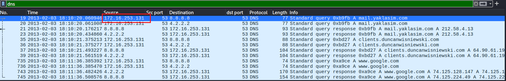 | .png) |

---

### Question 2: Mail Server Domain
*DNS response showing the mail server domain.*

| Evidence |
|----------|
| 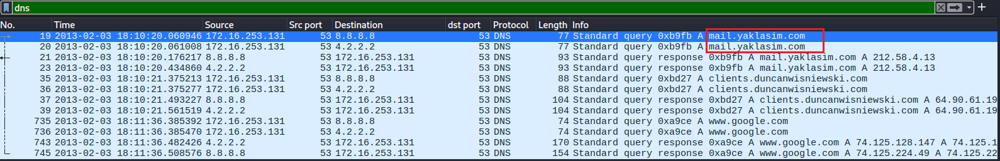 |

---

### Question 3: Mail Server IP Address
*The resolved IP address of the mail server.*

| Evidence | 
|----------|
| 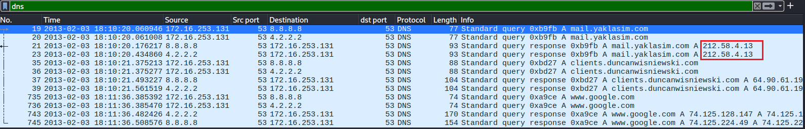 | 

---

### Question 4: Malicious URL Access
*HTTP request to the gate.php URL after mail server connection.*

| Evidence |
|----------|
| 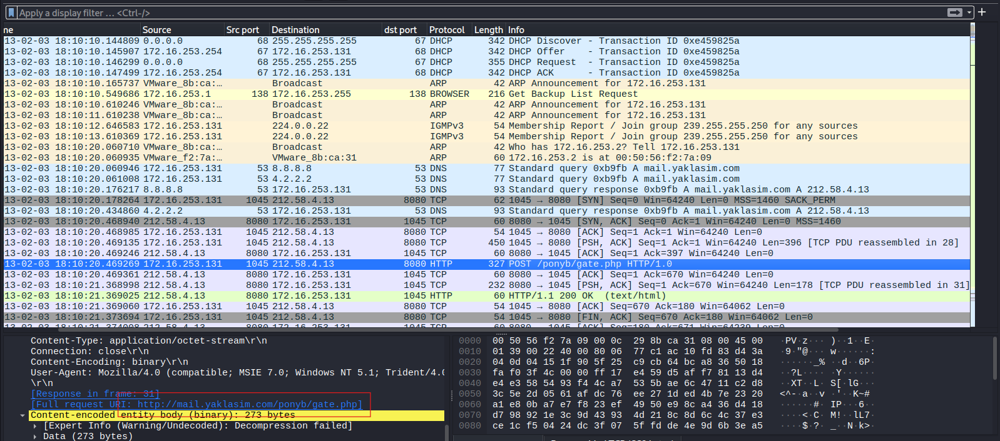 |

---

### Question 5: TCP Flags
*TCP flags section showing 0x018 (SYN/ACK).*

| Evidence | 
|----------|
| 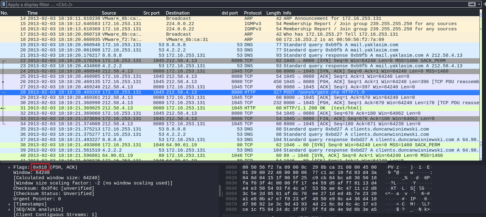 | 

---

### Question 6: C2 Domain Lookup
*Domain lookup for clients.duncanwisniewski.com.*

| Evidence |
|----------|
| 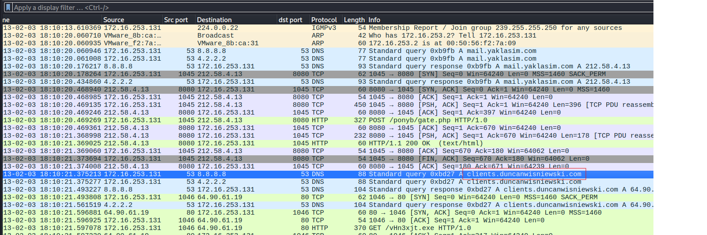 |

---

### Question 7: C2 IP Address
*Resolved IP address for the C2 domain.*

| Evidence | 
|----------|
| 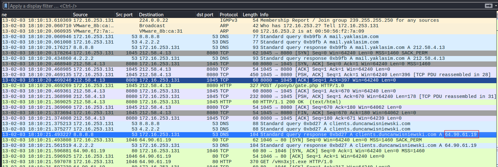 | 

---

### Question 8: Malware File Request
*HTTP request for vHn3xjt.exe.*

| Evidence | 
|----------|
| 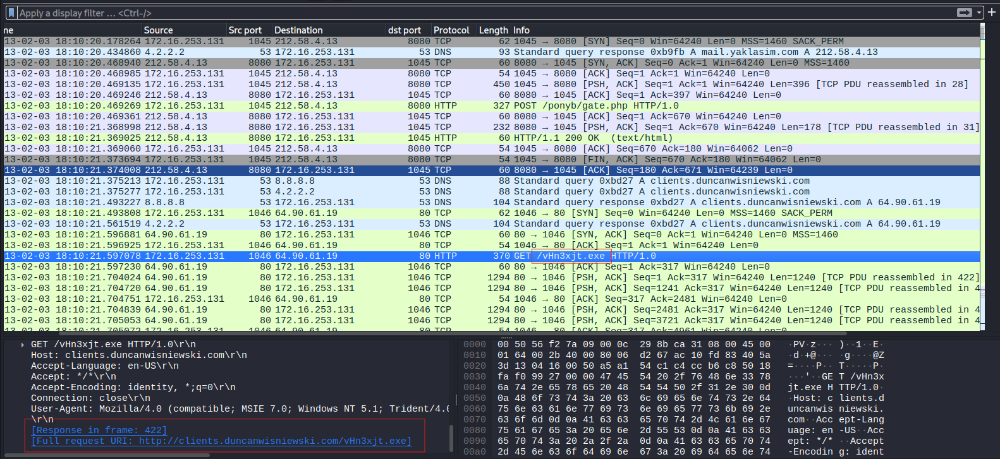 | 

---

### Question 9: Dropped PE File Location
*Any.run analysis showing dropped files landing in %APPDATA%.*

| Evidence |
|----------|
| 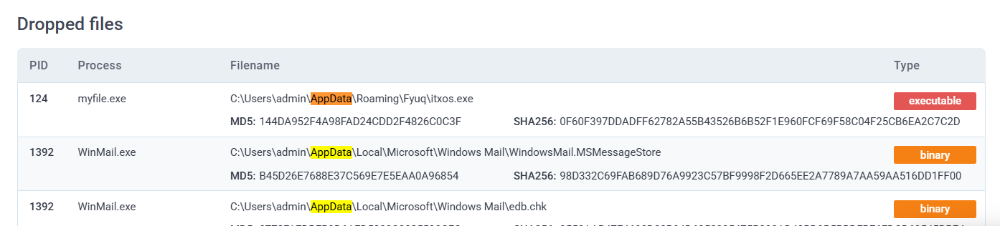 |

---

### Question 10: Called File Location
*Any.run process information revealing %LOCALAPPDATA%\Temp.*

| Evidence | Detail |
|----------|--------|
| 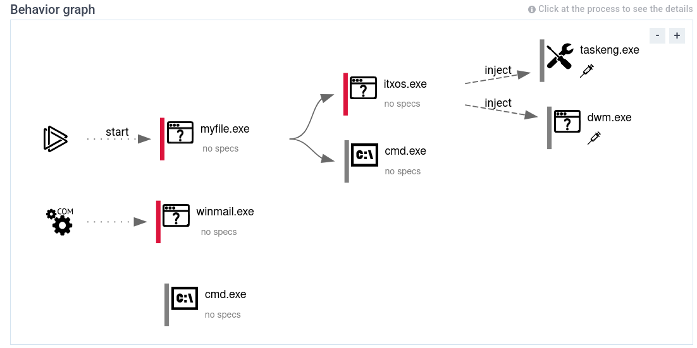 | .png) |

---

### Question 11: Ssdeep Hash
*VirusTotal Details tab showing the Ssdeep hash.*

| Evidence | 
|----------|
| 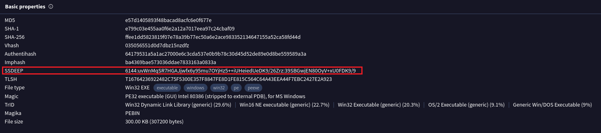 |

---

### Question 12: Microsoft Detection Name
*VirusTotal detection tab showing PWS:Win32/Zbot!GO.*

| Evidence |
|----------|
| 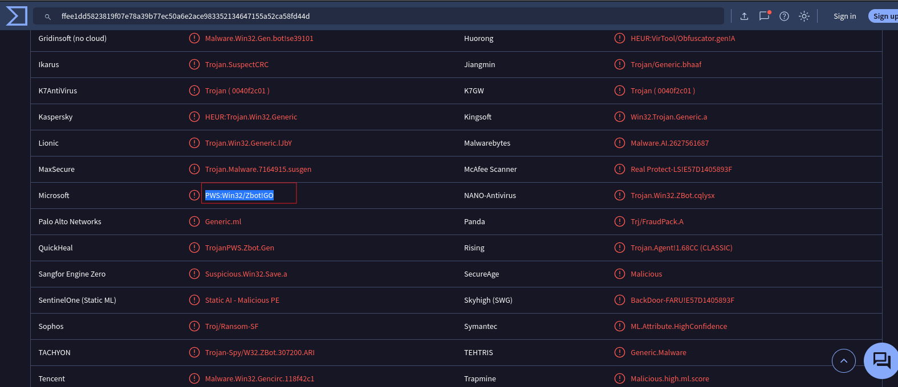 |

---

### Question 13: Registry Persistence
*MITRE ATT&CK reference for T1547.001 persistence key.*

| Evidence |
|----------|
| 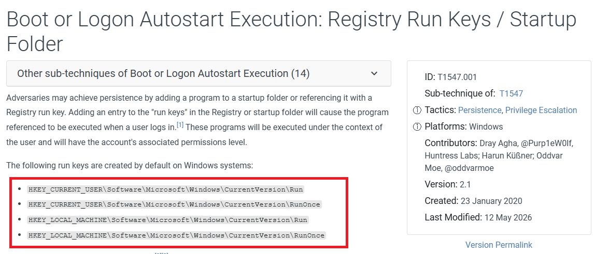 | 

---

## 📝 Key Takeaways

- **DNS analysis is foundational** – it maps infrastructure and reveals malicious domains early in an investigation.
- **TCP flags provide context** – they confirm connection states and handshake patterns during exfiltration or C2 communication.
- **VirusTotal and Any.run are indispensable** – they offer rapid enrichment for file hashes and dynamic behavior insights.
- **User-level persistence is stealthy** – malware operating under `%APPDATA%` avoids triggering privileged access alerts.
- **Detection names are volatile** – always correlate with timestamps and use multiple sources to confirm malware families.

---

## 🔗 External Links

- 📖 **Full Walkthrough (Medium)**: [Read Here]([https://medium.com/@raenaldsyaputra57/deimos-hacktrace-ranges-walkthrough](https://medium.com/@raenaldsyaputra57/deimos-hacktrace-ranges-walkthrough-04ff1ca9260a)) 
- 📂 **Back to Main Repository**: [Cybersecurity-Writeups](../../README.md)

---
