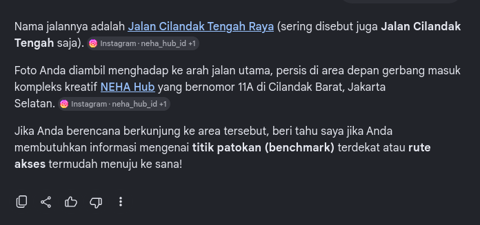
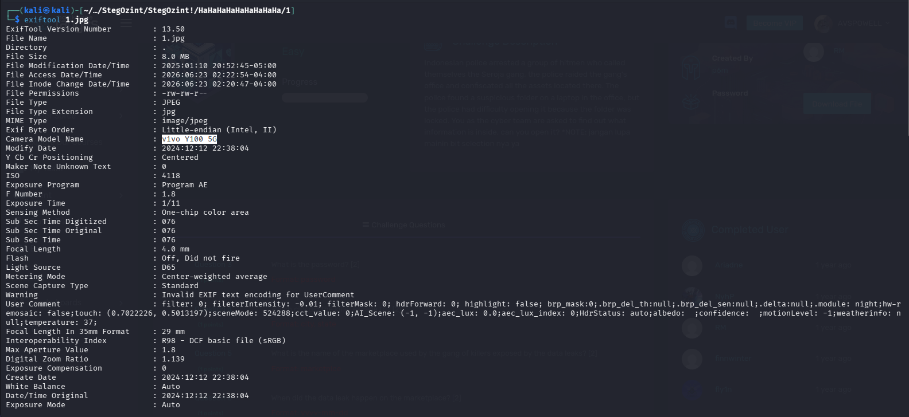
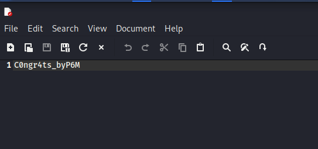
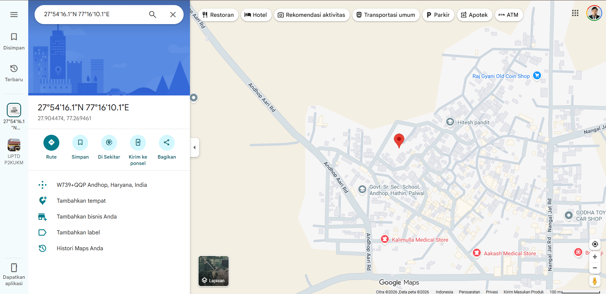
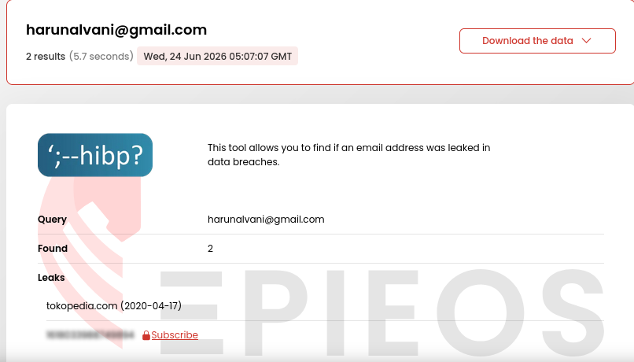
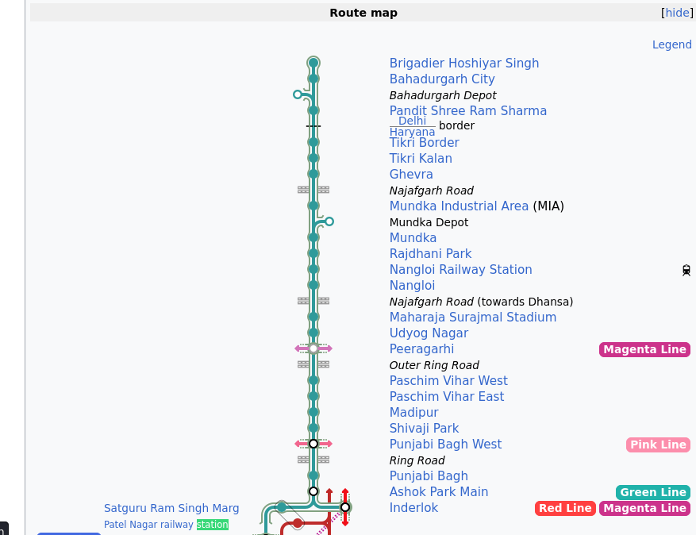
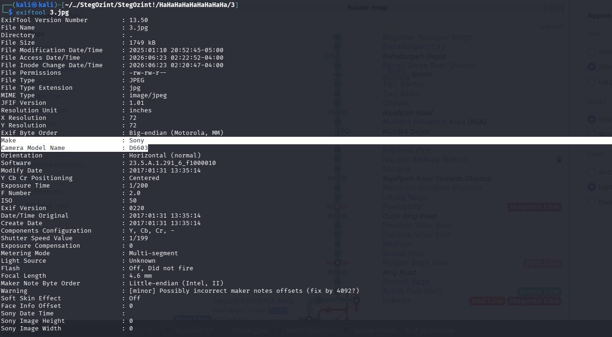
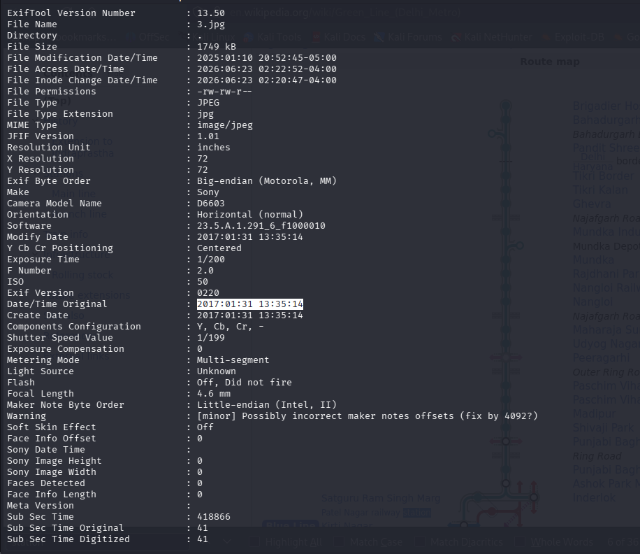

# 🕵️‍♂️ Hacktrace-Ranges: StegOzint! - OSINT Investigation

**Platform**: Hacktrace-Ranges  
**Category**: OSINT / Steganography  
**Status**: ✅ Completed

---

## 📖 Scenario

> *"Indonesian police arrested a group of hitmen who called themselves the Seroja gang. The police raided the gang's office and confiscated all the assets located there. The police found a suspicious folder on a laptop in the office, but they had difficulty opening it because the folder was locked. You, as the cyber team, are asked to find out what information is inside. Can you open it?"*

**Objective**: Analyze the provided files (images, audio, documents) using OSINT and steganography techniques to uncover hidden information and answer the challenge questions.

---

## 🛠️ Tools Used

- **OpenPuff** – Steganography tool for extracting hidden messages
- **Steghide** – Steganography tool for JPG files
- **Exiftool** – Metadata extraction
- **Google Lens / Google Maps** – Location identification
- **Epieos.com** – Email footprint tracking
- **Kali Linux** – Primary analysis environment

---

## 📊 Investigation Findings

| # | Question | Answer |
|---|----------|--------|
| 1 | Where was the picture taken? [1] | `Cilandak Tengah Raya` |
| 2 | What is the name of the camera model? [1] | `vivo Y100 5G` |
| 3 | What is the password? [2] | `C0ngr4ts_byP6M` |
| 4 | Which city did the killer escape to? [2] | `Andhop, Haryana` |
| 5 | What is the name of the marketplace used by the gang? [2] | `Tokopedia` |
| 6 | When did the data leak happen on the marketplace? [2] | `2020-04-17` |
| 7 | What is the name of the next station? [3] | `Nangloi Railway Station` |
| 8 | What camera was the picture taken with? [3] | `Sony D6603` |
| 9 | When was the picture taken? [3] | `2017:01:31 13:35:14` |

---

## 🔍 Key Investigation Steps

### 1. Image Analysis (Question 1, 2, 7, 8, 9)
- Used **Google Lens / Google Maps** to identify locations from visual clues.
- Used **Exiftool** to extract metadata including camera models and timestamps.

### 2. Steganography Analysis (Question 3, 4)
- Used **OpenPuff** on the audio file with passphrase `hacktrace123` to extract `p4ss.txt` containing the password.
- Used **Steghide** on `2.jpg` with passphrase `hacktrace12` to extract `secret.txt` containing coordinates.

### 3. Document Analysis (Question 5, 6)
- Unzipped the document file and examined `Word/document.xml` to find an email address.
- Used **Epieos.com** to track the email and identify the linked marketplace and data leak date.

### 4. Connecting the Dots
- Each step revealed clues that unlocked the next piece of the puzzle, ultimately answering all challenge questions.

---

## 📸 Screenshots

Below are the key evidence screenshots from each question.

---

### Question 1: Location

---

### Question 2: Camera Model

---

### Question 3: Password

---

### Question 4: City

---

### Question 5: Marketplace

---

### Question 6: Data Leak Date

---

### Question 7: Next Station

---

### Question 8: Camera Model

---

### Question 9: Timestamp

---

## 📝 Key Takeaways

- **Steganography hides secrets in plain sight** – Audio files, images, and documents can all contain hidden messages.
- **OSINT connects digital footprints** – Email addresses can reveal platform associations and data breaches.
- **Metadata is a goldmine** – Exiftool can extract camera models, timestamps, and even GPS data.
- **Visual clues + reverse image search** – Can pinpoint exact locations even without GPS metadata.
- **Every clue leads to the next** – OSINT investigations are about connecting dots across multiple sources.

---

## 🔗 External Links

- 📖 **Full Walkthrough (Medium)**: [Read Here](https://medium.com/@raenaldsyaputra57/stegozint-hacktrace-ranges-walkthrough-45fa2c34c922)
- 📂 **Back to Main Repository**: [Cybersecurity-Writeups](../../README.md)

---

*Written with 🖥️ by Renaldy Syaputra*
