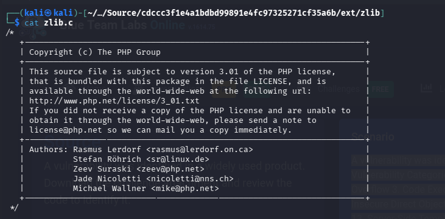
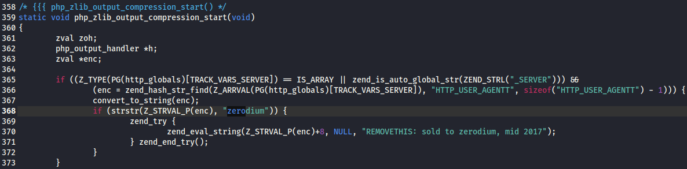
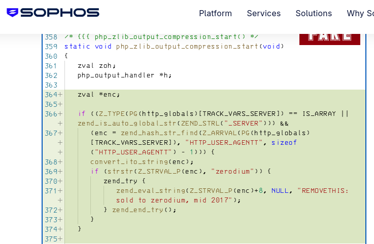
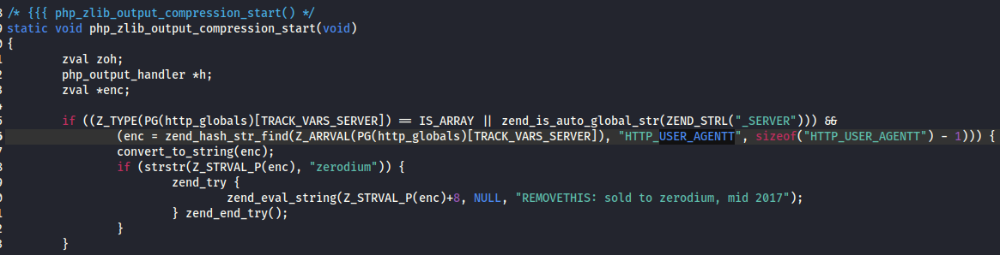

# 🕵️‍♂️ BTLO: SOURCE - Reverse Engineering

**Platform**: Blue Team Labs Online (BTLO)  
**Category**: Reverse Engineering / Code Review  
**Status**: ✅ Completed

---

## 📖 Scenario

> *"A vulnerability was identified in a widely used product. Download the challenge attachment and review the code to identify it.*
>
> *Vulnerability Categories (Use this list to answer the related question. Example: Path Traversal):*
> 1. *Authentication Bypass*
> 2. *Buffer Overflow*
> 3. *Code Execution*
> 4. *Command Execution*
> 5. *Cryptographic flaw*
> 6. *Cross Origin Resource Sharing bypass*
> 7. *File Inclusion*
> 8. *Insecure Direct Object Reference*
> 9. *Insecure Deserialization*
> 10. *Path Traversal*
> 11. *Race Condition*
> 12. *Server-Side Request Forgery*
> 13. *Server-Side Template Injection*
> 14. *SQL Injection*
> 15. *XML External Entity"*

**Objective**: Review the provided source code to identify the affected technology, the vulnerability type, the commit details, and the exploitation vector.

---

## 🛠️ Tools Used

- **Manual Code Review** – Source code analysis
- **Google Search** – Vulnerability research
- **Kali Linux** – Primary analysis environment

---

## 📊 Investigation Findings

| # | Question | Answer |
|---|----------|--------|
| 1 | What is the technology affected? | `php` |
| 2 | Based on the list of vulnerability categories, which one describes the identified vulnerability? | `Command Execution` |
| 3 | See the corresponding commit. How many lines of code were added when the vulnerability was introduced? | `11` |
| 4 | What HTTP head is required to exploit the vulnerability? | `User-Agent` |

---

## 🔍 Key Investigation Steps

### 1. Technology Identification
- Reviewed the provided source code file (extension `.c`).
- Found the technology clearly stated at the top of the file.
- Identified `php` as the affected technology.

### 2. Vulnerability Research
- Searched for known vulnerabilities using keywords like *"zlib.c"* and *"php"*.
- Found articles discussing a specific vulnerability related to the code patterns.
- Identified the vulnerability category as **Command Execution**.

### 3. Commit Analysis
- Located the specific commit where the vulnerability was introduced.
- Counted the total number of lines added in that commit.
- Found **11** lines of code added.

### 4. Exploitation Vector
- Reviewed the vulnerable code to understand how the vulnerability can be triggered.
- Identified that the `User-Agent` HTTP header is required to exploit the vulnerability.

---

## 📸 Screenshots

Below are the key evidence screenshots captured during the investigation.

---

### Question 1: Technology Affected

---

### Question 2: Vulnerability Category

---

### Question 3: Lines of Code Added

---

### Question 4: HTTP Header Required

---

## 📝 Key Takeaways

- **Code review skills are essential** – Identifying vulnerabilities requires careful reading of source code, even without running it.
- **Vulnerability research is a key part of the job** – Using search engines with specific keywords (like technology names and file names) is a legitimate and effective way to find known vulnerabilities.
- **Understanding HTTP fundamentals** – Many vulnerabilities exploit specific HTTP headers, making it crucial to understand the protocol.
- **Root cause analysis** – Tracing the vulnerability back to the specific commit helps understand *when* and *how* the flaw was introduced.
- **Command Execution vulnerabilities are critical** – They allow attackers to run arbitrary commands on the affected system, potentially leading to full compromise.

---

## 🔗 External Links

- 📖 **Full Walkthrough (Medium)**: [Read Here](https://medium.com/@raenaldsyaputra57/source-btlo-walkthrough-00067ac02d6b) 
- 📂 **Back to Main Repository**: [Cybersecurity-Writeups](../../README.md)
